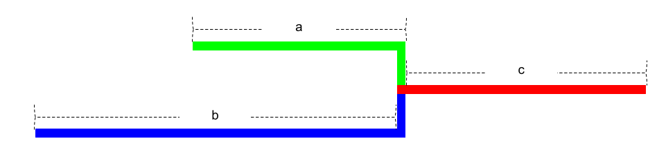

# 24. 两两交换链表中的节点，19.删除链表的倒数第N个节点，面试题 02.07. 链表相交，142.环形链表II。

[day 4 第二章 链表](https://docs.qq.com/doc/DUFNjYUxYRHRVWklp)

## [24. 两两交换链表中的节点](https://leetcode.com/problems/swap-nodes-in-pairs/) 

初尝试：

```java
/**
 * Definition for singly-linked list.
 * public class ListNode {
 *     int val;
 *     ListNode next;
 *     ListNode() {}
 *     ListNode(int val) { this.val = val; }
 *     ListNode(int val, ListNode next) { this.val = val; this.next = next; }
 * }
 */
class Solution {
    public ListNode swapPairs(ListNode head) {
        if (head == null || head.next == null) return head; // 初始的判断，是否可以进行交换，可以省略
        ListNode dummy = new ListNode(-1, head);
        ListNode cur = dummy;
       while(cur.next !=null && cur.next.next != null) { // 注意退出循环的条件，除了 cur.next ==null，还有 cur.next.next == null
            cur = swap(cur);
            cur = cur.next.next;
        }
        return dummy.next;
    }
    
    public ListNode swap(ListNode pred) {
        ListNode temp1, temp2, temp3;
        temp1 = pred.next.next.next;
        temp2 = pred.next;
        temp3 = pred.next.next;

        pred.next = temp3;
        temp3.next = temp2;
        temp2.next = temp1;
        return pred;
    }
}
```

[代码随想录](https://programmercarl.com/0024.%E4%B8%A4%E4%B8%A4%E4%BA%A4%E6%8D%A2%E9%93%BE%E8%A1%A8%E4%B8%AD%E7%9A%84%E8%8A%82%E7%82%B9.html#_24-%E4%B8%A4%E4%B8%A4%E4%BA%A4%E6%8D%A2%E9%93%BE%E8%A1%A8%E4%B8%AD%E7%9A%84%E8%8A%82%E7%82%B9)

[视频讲解](https://www.bilibili.com/video/BV1YT411g7br/?vd_source=198a0e84361b101846f9b1da10a0aea2)

> 循环终止时，偶数个节点：`cur.next == null`，奇数个节点：`cur.next.next == null`，要先判断`cur.next == null`才能保证`cur.next.next == null`不会报错。`cur`不可能为空，因为从`dummy`开始遍历。


## [19.删除链表的倒数第N个节点](https://leetcode.com/problems/remove-nth-node-from-end-of-list/) 

```java
/**
 * Definition for singly-linked list.
 * public class ListNode {
 *     int val;
 *     ListNode next;
 *     ListNode() {}
 *     ListNode(int val) { this.val = val; }
 *     ListNode(int val, ListNode next) { this.val = val; this.next = next; }
 * }
 */
class Solution {
    public ListNode removeNthFromEnd(ListNode head, int n) {
        ListNode cur = head;
        int size = 0;
        while(cur != null) {
            size++;
            cur = cur.next;
        }
        
        if(n <= 0 || n > size) return head;
        
        ListNode dummy = new ListNode(-1, head);
        ListNode pred = dummy;
        
        for (int i = 0; i < size - n; i++ ) {
            pred = pred.next;
        }
        
        pred.next = pred.next.next;
        
        return dummy.next;
    }
}
```

[代码随想录](https://programmercarl.com/0019.%E5%88%A0%E9%99%A4%E9%93%BE%E8%A1%A8%E7%9A%84%E5%80%92%E6%95%B0%E7%AC%ACN%E4%B8%AA%E8%8A%82%E7%82%B9.html#_19-%E5%88%A0%E9%99%A4%E9%93%BE%E8%A1%A8%E7%9A%84%E5%80%92%E6%95%B0%E7%AC%ACn%E4%B8%AA%E8%8A%82%E7%82%B9)

[视频讲解](https://www.bilibili.com/video/BV1vW4y1U7Gf/?spm_id_from=333.788&vd_source=198a0e84361b101846f9b1da10a0aea2)

> 如何只遍历一次节点？
>
> 双指针的经典应用，如果要删除倒数第n个节点，让fast移动n步，然后让fast和slow同时移动，直到fast指向链表末尾。删掉slow所指向的节点就可以了。

优化：使用快慢指针，只遍历一次节点

```java
class Solution {
    public ListNode removeNthFromEnd(ListNode head, int n) {
        
        ListNode dummy = new ListNode(-1, head);
        ListNode fast = dummy;
        ListNode slow = dummy;
        
       // 注意，为了让slow 指向待删除节点的前一节点，需要让 fast 移动 n+1 步
        for (int i = 0; i <= n; i++ ) {
            fast = fast.next;
        }
        
        while (fast != null) {
        		fast = fast.next;
        		slow = slow.next;
        }
         slow.next = slow.next.next;
        
        return dummy.next;
    }
}
```


## [面试题 02.07. 链表相交](https://leetcode.com/problems/intersection-of-two-linked-lists/)

初尝试：

```java
 * Definition for singly-linked list.
 * public class ListNode {
 *     int val;
 *     ListNode next;
 *     ListNode(int x) {
 *         val = x;
 *         next = null;
 *     }
 * }
 */
public class Solution {
    public ListNode getIntersectionNode(ListNode headA, ListNode headB) {
        
        ListNode tempA = headA;
        ListNode tempB = headB;
        
        while (tempA != null) {
            tempB = headB;
            while (tempB != null) {
                if (tempA == tempB) return tempA;
                tempB = tempB.next;
            }
            tempA =tempA.next; 
        }
        
        return null;
    }
}
```

[代码随想录](https://programmercarl.com/%E9%9D%A2%E8%AF%95%E9%A2%9802.07.%E9%93%BE%E8%A1%A8%E7%9B%B8%E4%BA%A4.html#%E6%80%9D%E8%B7%AF)

> Observe that while list A and list B could be different lengths, that  the shared "tail" following the intersection has to be the *same* length. 
>
> Because the "tails" must be the same length, we can conclude that *if* there is an intersection, then the intersection node will be one of these 5 possibilities.
>
> So, to check for each of these pairs, we would start by setting a  pointer at the start of the shorter list, and a pointer at the first  possible matching node of the longer list. The position of this node is  simply the difference between the two lengths, that is, `|M - N|`.Then, we just need to step the two pointers through the list, each time checking whether or not the nodes are the same.
>
> In code, we could write this algorithm with 4 loops, one after the other, each doing the following:
>
> 1. Calculate N; the length of list A.
> 2. Calculate M; the length of list B.
> 3. Set the start pointer for the *longer* list.
> 4. Step the pointers through the list together.

```java
public class Solution {
    public ListNode getIntersectionNode(ListNode headA, ListNode headB) {
        ListNode curA = headA;
        ListNode curB = headB;
        int lenA = 0, lenB = 0;
        while (curA != null) { // 求链表A的长度
            lenA++;
            curA = curA.next;
        }
        while (curB != null) { // 求链表B的长度
            lenB++;
            curB = curB.next;
        }
        curA = headA;
        curB = headB;
        // 让curA为最长链表的头，lenA为其长度
        if (lenB > lenA) {
            //1. swap (lenA, lenB);
            int tmpLen = lenA;
            lenA = lenB;
            lenB = tmpLen;
            //2. swap (curA, curB);
            ListNode tmpNode = curA;
            curA = curB;
            curB = tmpNode;
        }
        // 求长度差
        int gap = lenA - lenB;
        // 让curA和curB在同一起点上（末尾位置对齐）
        while (gap-- > 0) {
            curA = curA.next;
        }
        // 遍历curA 和 curB，遇到相同则直接返回
        while (curA != null) {
            if (curA == curB) {
                return curA;
            }
            curA = curA.next;
            curB = curB.next;
        }
        return null;
    }

}

```

优化：

1. 使用一次循环：

> While this would have a time complexity of O(N+M) and a space complexity of O(1) and would be fine for an interview, we can still simplify the code a  bit! **As some quick reassurance, most people will struggle to come up  with this next part by themselves. It takes practice and seeing lots of linked list and other math problems.**
>
> If we say that `c` is the *shared* part, `a` is *exclusive part of list A* and `b` is *exclusive part of list B*, then we can have one pointer that goes over `a + c + b` and the other that goes over `b + c + a`. Have a look at the diagram below, and this should be fairly intuitive.
>
> [](https://imgur.com/a/XSduqFR)
>
> 
>
> [diagram](https://imgur.com/a/XSduqFR)
>
> This is the above algorithm in disguise - one pointer is essentially  measuring the length of the longer list, and the other is measuring the  length of the shorter list, and then placing the start pointer for the  longer list. Then both are stepping through the list together. By seeing the solution in this way though, we can now implement it as a single  loop.
>
> **Algorithm**
>
> - Set pointer `pA` to point at `headA`.
> - Set pointer `pB` to point at `headB`.
> - While `pA` and `pB` are not pointing at the same node:
>   - If `pA` is pointing to a null, set `pA` to point to `headB`.
>   - Else, set `pA` to point at `pA.next`.
>   - If `pB` is pointing to a null, set `pB` to point to `headA`.
>   - Else, set `pB` to point at `pB.next`.
> - return the value pointed to by `pA` (or by `pB`; they're the same now).

```java
public class Solution {
    public ListNode getIntersectionNode(ListNode headA, ListNode headB) {
        ListNode pA = headA;
        ListNode pB = headB;
        while (pA != pB) {
            pA = pA == null ? headB : pA.next;
            pB = pB == null ? headA : pB.next;
        }
        return pA;
        // Note: In the case lists do not intersect, the pointers for A and B
        // will still line up in the 2nd iteration, just that here won't be
        // a common node down the list and both will reach their respective ends
        // at the same time. So pA will be NULL in that case.
    }
}
```

2. 使用哈希表：

> Instead of repeatedly traversing through list B though, we could  simply traverse it once and store each node in a hash table. We could  then traverse through list A once, each time checking whether the  current node exists in the hash table.

```java
public class Solution {
    public ListNode getIntersectionNode(ListNode headA, ListNode headB) {
        Set<ListNode> nodesInB = new HashSet<ListNode>();

        while (headB != null) {
            nodesInB.add(headB);
            headB = headB.next;
        }

        while (headA != null) {
            // if we find the node pointed to by headA,
            // in our set containing nodes of B, then return the node
            if (nodesInB.contains(headA)) {
                return headA;
            }
            headA = headA.next;
        }

        return null;
    }
}
```

## [142.环形链表II](https://leetcode.com/problems/linked-list-cycle-ii/)

[代码随想录](https://link.zhihu.com/?target=https%3A//programmercarl.com/0142.%E7%8E%AF%E5%BD%A2%E9%93%BE%E8%A1%A8II.html)
